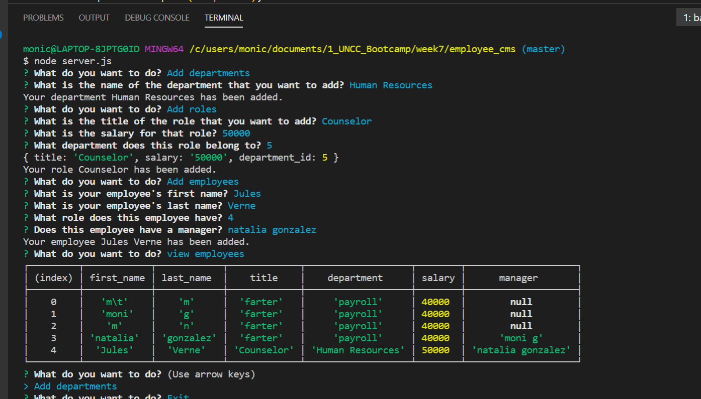
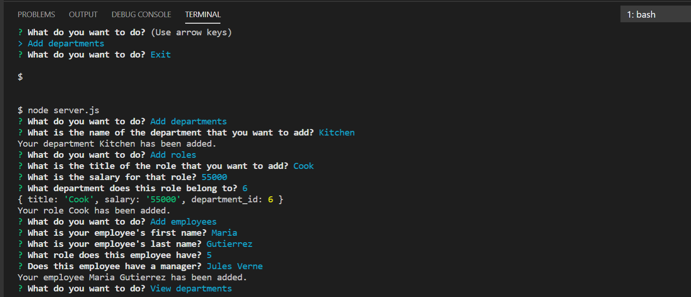
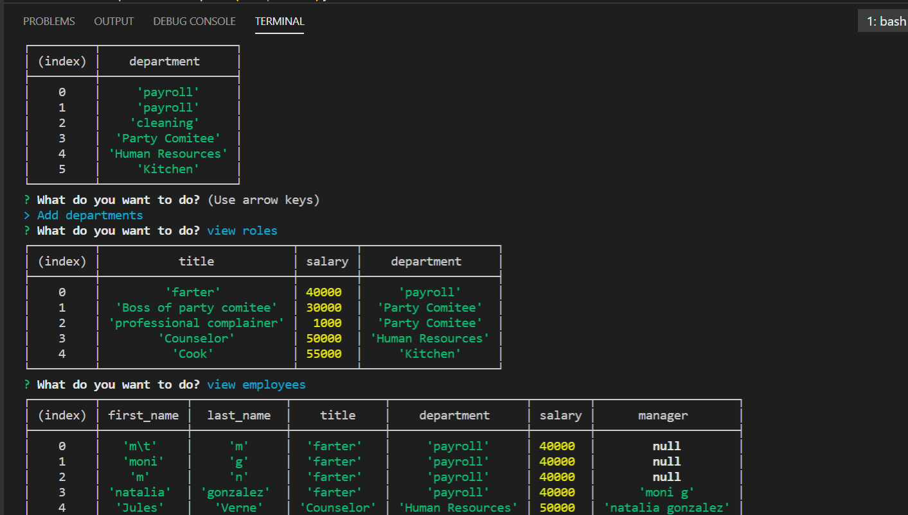

# employee_cms

# Description

Command-line application that uses MySQL and Node.js and allows the user to:
  * Add departments, roles, employees
  * View departments, roles, employees
  * Update employee roles

